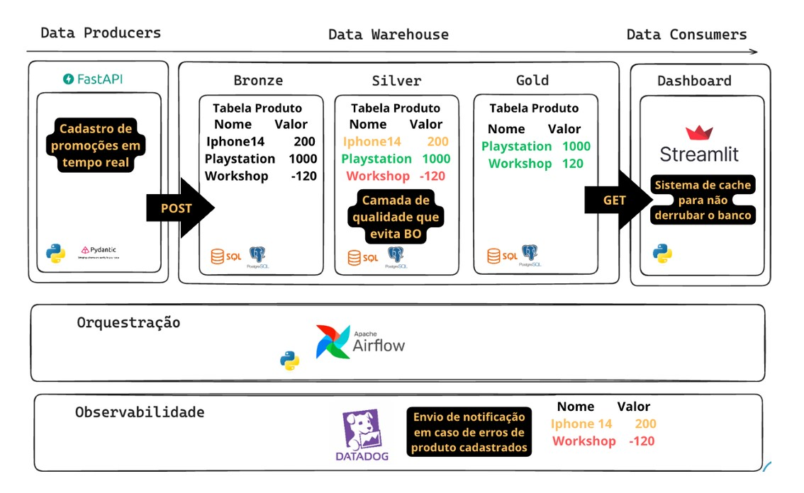

# Workshop | Do Jupyter Notebook pro Deploy em Produção | Banco de Dados

Tags: Postgres, SQL
Last edited time: 11 de dezembro de 2023 17:31
Status: In progress

# Introdução

Este é a **segunda etapa** da workshop. Já criamos nossa API, com testes de validação, documentação e deploy (entre outros recursos). Agora, é hora de criar nosso **banco de dados** para armazenar a inserção de dados feita pela API.

## Ordem de tarefas:



Tarefas a serem implementadas. Imagem por Luciano Galvão.

O que vamos implementar neste repositório?

- [ ]  ******API******
- [ ]  ********CRUD********
- [x]  ****************************Subir instância no banco****************************
- [ ]  **************Streamlit**************
- [ ]  **************Airflow**************

### Repositório central do projeto de referência:

- [Repositório central](https://github.com/lvgalvao/Do-Jupyter-Notebook-Pro-Deploy)

---

# 1. Criando nosso banco

**Recursos que vamos utilizar:**
- PosgreSQL
- pg4admin

**Repositório de referência para criação de banco:**

[https://github.com/lvgalvao/SQL-Do-Jupyter-Notebook-Pro-Deploy](https://github.com/lvgalvao/SQL-Do-Jupyter-Notebook-Pro-Deploy)

Como vamos trabalhar em um projeto distinto do anterior, vamos criar um repositório totalmente novo dentro do nosso diretório.

```bash
gh repo create
```

**********OBS:********** caso seja a primeira vez que tu estejas usando esse comando, ver:

- [GitHub CLI](https://cli.github.com/)

## 1.1 Trabalhar com o docker

Instalar o postgres e o pg4admin na máquina pode ser complicado, né? Imagina se fosse necessário para cada pessoa fazer isso individualmente. Para evitar o “na minha máquina, funciona”, vamos usar uma **imagem do Postgres no docker**. No link abaixo, temos acesso a uma imagem oficial do postgres.

- [postgres - Official Image | Docker Hub](https://hub.docker.com/_/postgres)

Temos uma imagem do postgres no Docker Desktop. Para criar nosso container, há **duas** opções (spoiler: vamos usar a **segunda**):

### I. Usando a imagem oficial do PostgreSQL

1. **Pull da Imagem do PostgreSQL**: Se você ainda não tem a imagem do PostgreSQL, pode obtê-la usando o comando `docker pull`:

    ```powershell
    docker pull postgres
    ```

2. **Executando o Contêiner PostgreSQL**: Para iniciar um contêiner com PostgreSQL, use o comando `docker run`. Você pode especificar a senha do superusuário, o nome do banco de dados e o nome de usuário como variáveis de ambiente:

    ```bash
    docker run --name meu_postgres -e POSTGRES_PASSWORD=minha_senha -e POSTGRES_USER=meu_usuario -e POSTGRES_DB=meu_banco -p 5432:5432 -v meu_volume_postgres:/var/lib/postgresql/data -d postgres
    ```

    Substitua `minha_senha`, `meu_usuario` e `meu_banco` `meu_volume_postgres` pelos valores desejados.

    - `-name meu_postgres`: Define o nome do contêiner como `meu_postgres`.
    - `e POSTGRES_PASSWORD=minha_senha`: Define a senha do superusuário para `minha_senha`.
    - `e POSTGRES_USER=meu_usuario`: Cria um usuário com o nome `meu_usuario`.
    - `e POSTGRES_DB=meu_banco`: Cria um banco de dados com o nome `meu_banco`.
    - `v meu_volume_postgres:/var/lib/postgresql/data`: Monta um volume chamado `meu_volume_postgres` na pasta `/var/lib/postgresql/data` dentro do contêiner. Se o volume `meu_volume_postgres` não existir, ele será criado automaticamente pelo Docker.
    - `p 5432:5432`: Mapeia a porta 5432 do contêiner para a porta 5432 na máquina host.
    - `d`: Executa o contêiner em background.
    - **Persistência de Dados**: Armazena os dados do banco de dados no volume `meu_volume_postgres`. Mesmo se o contêiner for removido, os dados permanecerão no volume e estarão disponíveis quando você criar um novo contêiner com o mesmo volume.
    - **Gerenciamento de Volume**: O Docker gerencia este volume, e você pode encontrar os dados armazenados no local de armazenamento de volumes do Docker no seu sistema host.

### II. Criando um arquivo Dockerfile (o que vamos usar)

O Dockerfile é um arquivo de texto que contém todas as instruções necessárias para criar uma imagem Docker. Você pode criar uma imagem Docker do PostgreSQL usando um Dockerfile. Aqui, vou mostrar como criar uma imagem Docker do PostgreSQL usando um Dockerfile.

1. **Criando um Dockerfile**: Crie um arquivo chamado `Dockerfile` e adicione o seguinte conteúdo:

    ```
    # Use the official PostgreSQL image as a base
    FROM postgres:latest

    # Set environment variables
    ENV POSTGRES_PASSWORD=minha_senha
    ENV POSTGRES_USER=meu_usuario
    ENV POSTGRES_DB=meu_banco

    # Expose the default PostgreSQL port
    EXPOSE 5433

    # Set the default command to run when starting the container
    CMD ["postgres"]

    ```


Após o Dockerfile estar pronto, você pode criar uma imagem Docker usando o comando `docker build`:

```
docker build -t minha_imagem_postgres .
```

- `t meu_postgres`: Define o nome da imagem como `meu_postgres`.

Após a criação da imagem, você pode executar um contêiner com o comando `docker run`:

```
docker run --name meu_container_postgres -p 5433:5432 -v meu_volume_postgres:/var/lib/postgresql/data -d minha_imagem_postgres
```

- `-name meu_postgres`: Define o nome do contêiner como `meu_postgres`.
- `p 5433:5432`: Mapeia a porta 5433 do contêiner para a porta 5432 na máquina host.
- `v meu_volume_postgres:/var/lib/postgresql/data`: Monta um volume chamado `meu_volume_postgres` na pasta `/var/lib/postgresql/data` dentro do contêiner. Se o volume `meu_volume_postgres` não existir, ele será criado automaticamente pelo Docker.
- `d`: Executa o contêiner em background.

## 1.2 Criando imagem pgadmin para acessarmos nosso banco

Para interagirmos com nosso banco postgres, vamos criar um container com imagem do pgadmin. Acesse o link abaixo para maiores informações:

[Container Deployment — pgAdmin 4 8.0 documentation](https://www.pgadmin.org/docs/pgadmin4/latest/container_deployment.html)

No terminal, basta colocar o seguinte comando:

```bash
docker pull dpage/pgadmin4
docker run -p 80:80 \
    -e 'PGADMIN_DEFAULT_EMAIL=user@domain.com' \
    -e 'PGADMIN_DEFAULT_PASSWORD=SuperSecret' \
    -e 'PGADMIN_CONFIG_ENHANCED_COOKIE_PROTECTION=True' \
    -e 'PGADMIN_CONFIG_LOGIN_BANNER="Authorised users only!"' \
    -e 'PGADMIN_CONFIG_CONSOLE_LOG_LEVEL=10' \
    -d dpage/pgadmin4
```

O container será criado com a porta 80:80. Com este rodando, simplesmente abra-o no [localhost](http://localhost). Será solicitado que tu coloques o ************email************ e o ****************password**************** definidos ao criar o container (nesse caso, `user@domain.com` e `SuperSecret`). Feito isso…


…eis nosso pgadmin aberto no browser!

Falta agora conectarmos com nosso banco postgres que criamos no container Docker. Em **Add New Server** crie novo servidor com as configurações definidas acima. Para identificar o endereço de IP usado para conectar-se ao banco, passe o seguinte comando no terminal:


```bash
docker inspect -f '{{range.NetworkSettings.Networks}}{{.IPAddress}}{{end}}' meu_container_postgres
```

Retornado o IP, cole-o em **Hostname/Address**. A conexão com o postgres deverá ser bem-sucedida e teremos acesso ao nosso banco!


Acesso ao banco com Docker: livre para fazer DELETE sem WHERE!

Aqui, poderíamos **criar nosso banco**, tal qual o nosso dicionário criado na API - nosso objetivo é livrar-nos dela e criar tudo no banco:

```sql
CREATE TABLE produtos (
    id SERIAL PRIMARY KEY,
    titulo VARCHAR(255) NOT NULL,
    descricao TEXT,
    preco NUMERIC(10,2)
);
```

…fazer uma ************************consulta************************:

```sql
SELECT * FROM produtos;
```

…fazer um ************update************:

```sql
UPDATE produtos SET preco = 5000 WHERE id = 1;
```

E por aí vai. Mas, no nosso caso, vamos trabalhar com o conceito de **Object Relational Mapping (ORM)**. E por quê? Vamos ver agora…

# 2. Criando tabelas com ORM

Pense na situação seguinte: tu criaste todo o banco de dados do projeto em postgres mas, em um determinado momento, houve demanda de migrar o banco para um MySQL. Nesse caso, o script terá divergências de sintaxe entre postgres e MySQL - o SQL puro fica ok, mas sabemos que há algumas funções e notações exclusivas para cada banco. E agora?

É aí que entra a **ORM**. Nesse caso, a **engine dá conta da linguagem***, e não temos que preocupar-se com a “gramática” específica de cada banco. Nesse caso, o projeto migraria com maior facilidade, tendo-se apenas que alterar a engine utilizada. O maior nível de **abstração** fornecido por ORMs permitem a criação e a manipulação de tabelas sem a necessidade de escrever SQL. Como resultado, temos um um código mais legível e de maior facilidade de manutenção.

## 2.1 O SQLAlchemy

O ORM que vamos usar é o SQLAlchemy, biblioteca que precisaremos instalar. Em conjunto, instalaremos o `psycopg2-binary`, adaptador PostgreSQL para Python.

```python
poetry add sqlalchemy psycopg2-binary
```

Criamos, na sequência, um arquivo `database.py`.

```python
from sqlalchemy import create_engine, Column, Integer, String, Float
from sqlalchemy.orm import sessionmaker, declarative_base

import os
from dotenv import load_dotenv

load_dotenv()  # Carrega as variáveis de ambiente do arquivo .env

db_user = os.getenv("POSTGRES_USER")
db_password = os.getenv("POSTGRES_PASSWORD")
db_name = os.getenv("POSTGRES_DB")
db_host = os.getenv("DB_HOST")
db_port = os.getenv("DB_PORT")

# Configurando a conexão com o banco de dados

DATABASE_URL = f"postgresql://{db_user}:{db_password}@{db_host}:{db_port}/{db_name}"

# Criando a engine de conexão

engine = create_engine(DATABASE_URL)

# Criando a sessão

Session = sessionmaker(bind=engine)

Base = declarative_base()

# Definindo o modelo de dados
class Produto(Base):
    __tablename__ = "produtos"

    id = Column(Integer, primary_key=True, index=True)
    titulo = Column(String, nullable=False)
    descricao = Column(String)
    preco = Column(Float, nullable=False)

# Criando a tabela
Base.metadata.create_all(bind=engine)
```

Após definirmos nossas variáveis de ambiente com o `dotenv` , vamos criar uma ************sessão.************ Esse passo é importante, visto que queremos entrar e fazer o logoff, sem obstruir o acesso ao banco.

Notar aqui a semelhança com o **pydantic**. Criamos uma classe `Produto()`, que toma como parâmetro a variável `Base`, que representa a função `declarative_base()`, importada do SQLAlchemy ORM. E o que ela faz? Bem, como o nome sugere, ela ******************************declara modelos****************************** de dados! É como se estivéssemos definido o schema da nossa table, só que por Python e sem nenhuma linguagem específica SQL. criamos o nome da tabela usando o atributo `__tablename__` e, após, estipulamos as colunas da nossa tabela, bem com as restrições em termos de quais tipos de dados podemos inserir em cada uma. Note, por exemplo que `titulo` deve ser uma string não nula, ao passo que `descricao` aceita campo vazio.

Por fim, criamos a tabela, que estará disponível no nosso banco. Vamos verificar:


Está viva! Tabela criada com ORM direto no nosso banco!

Feito isso, é hora de **conectar nossa API e refatorar tudo que fizemos**. Vamos voltar ao repositório anterior.

- [Volte duas casas - vá para API de novo!](https://github.com/felipesebben/API-workshop)


# 3. Refatorando umas coisas - criar mais de uma variável de ambiente

Vamos criar dois arquivos a partir do `.env`: um `.env.dev`, e outro `.env.prod`. E por quê? Se eu quiser criar uma tabela no banco de dev, é só passar:

```python
load_dotenv(dotenv_path=".env.dev")
```

Na variável de produção, é importante pegar no render as credenciais necessárias:

- Password
- Database
- Username
- Host

Em seguida, rode o `main.py` e verifique no render se a tabela foi criada no pgadmin. Pode deletar a conexão com o banco criado mediante a imagem do docker. Pode deletar a imagem também!

Abra o pgadmin e adicione as credenciais criadas no render. Verifique se o banco está disponível e se a tabela foi criada, tal qual o resultado abaixo.


Um banco livre de máquina local - PostgreSQL no render!

Qual o próximo passo? Mudar as variáveis de ambiente de maneira igual no nosso [repositório anterior](https://github.com/felipesebben/API-workshop).

# 4. Conclusão
Nesta etapa, concluímos a implementação do nosso banco de dados. Partimos de uma criação em ambiente local, em um contêiner Docker, e subimos este para um serviço cloud.
